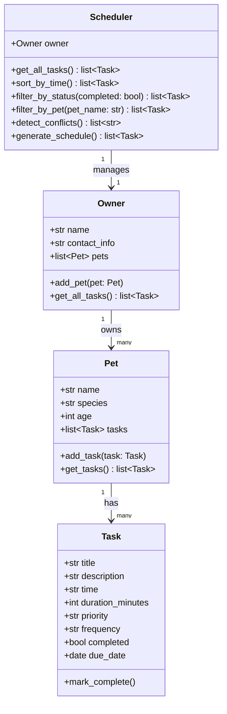

# PawPal+ UML Diagram (Draft)

```mermaid
classDiagram
    class Owner {
        +str name
        +str contact_info
        +list~Pet~ pets
        +add_pet(pet: Pet)
        +get_all_tasks() list~Task~
    }

    class Pet {
        +str name
        +str species
        +int age
        +list~Task~ tasks
        +add_task(task: Task)
        +get_tasks() list~Task~
    }

    class Task {
        +str title
        +str description
        +str time
        +int duration_minutes
        +str priority
        +str frequency
        +bool completed
        +date due_date
        +mark_complete()
    }

    class Scheduler {
        +Owner owner
        +get_all_tasks() list~Task~
        +sort_by_time() list~Task~
        +filter_by_status(completed: bool) list~Task~
        +filter_by_pet(pet_name: str) list~Task~
        +detect_conflicts() list~str~
        +generate_schedule() list~Task~
    }

    Owner "1" --> "many" Pet : owns
    Pet "1" --> "many" Task : has
    Scheduler "1" --> "1" Owner : manages
```
