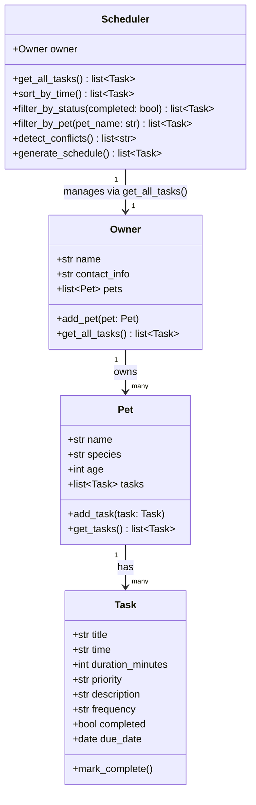

# PawPal+ UML Diagram (Final)

This matches the final implementation in `pawpal_system.py`.

## Changes from draft UML
- No structural changes required — the initial design held up through implementation.
- `mark_complete()` in `Task` now handles recurrence internally (advances `due_date` and resets `completed` for daily/weekly tasks), which was anticipated in the draft but not explicitly shown.
- `generate_schedule()` delegates to `filter_by_status(False)` rather than re-implementing sorting — a simplification discovered during implementation.
